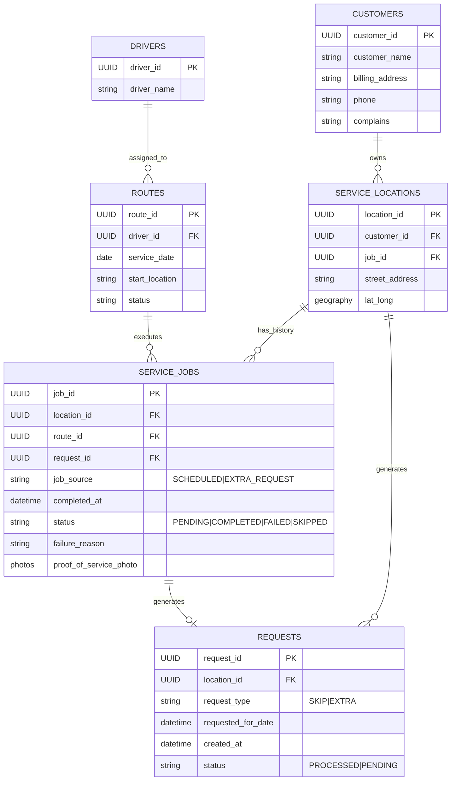

```mermaid
erDiagram
    CUSTOMERS {
        UUID customer_id PK
        string customer_name
        string billing_address
        string phone
        string complains
    }

    SERVICE_LOCATIONS {
        UUID location_id PK
        UUID customer_id FK
        UUID job_id FK
        string street_address
        geography lat_long
    }

    DRIVERS {
        UUID driver_id PK
        string driver_name
    }

    %% Dynamic / Daily Data
    ROUTES {
        UUID route_id PK
        UUID driver_id FK
        date service_date
        string start_location
        string status
    }

    SERVICE_JOBS {
        UUID job_id PK
        UUID location_id FK
        UUID route_id FK
        UUID request_id FK
        string job_source "SCHEDULED|EXTRA_REQUEST"
        datetime completed_at
        string status "PENDING|COMPLETED|FAILED|SKIPPED"
        string failure_reason
        photos proof_of_service_photo
    }

    REQUESTS {
        UUID request_id PK
        UUID location_id FK
        string request_type "SKIP|EXTRA"
        datetime requested_for_date
        datetime created_at
        string status "PROCESSED|PENDING"
    }

    %% Relationships
    CUSTOMERS ||--o{ SERVICE_LOCATIONS : "owns"
    DRIVERS ||--o{ ROUTES : "assigned_to"
    ROUTES ||--o{ SERVICE_JOBS : "executes"
    SERVICE_JOBS ||--o| REQUESTS : "generates"
    SERVICE_LOCATIONS ||--o{ SERVICE_JOBS : "has_history"
    SERVICE_LOCATIONS ||--o{ REQUESTS : "generates"
```